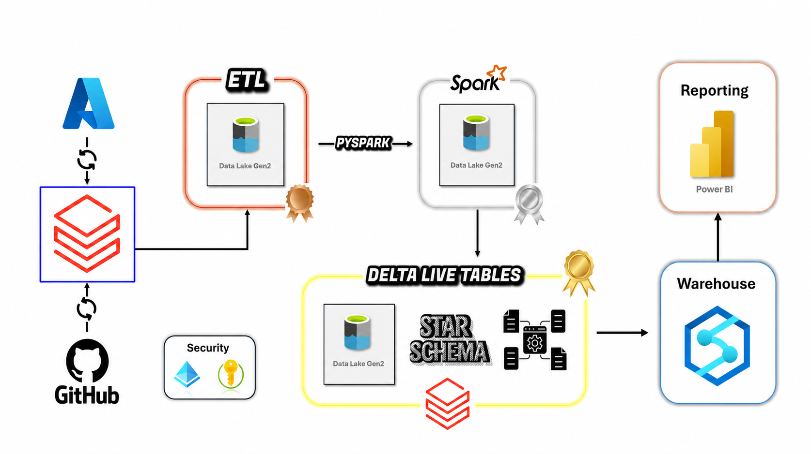

# Enterprise Data Engineering Pipeline on Azure Databricks


## Overview

This project implements an end-to-end **Modern Data Engineering Pipeline** using the **Medallion Architecture (Bronze, Silver, Gold)** on **Azure Databricks**.

The solution ingests raw business datasets into Azure Data Lake Storage Gen2, performs data cleansing and transformation using Apache Spark, applies Slowly Changing Dimension (SCD Type 2) logic through Delta Live Tables (DLT), and builds dimensional models for analytics and reporting.

The architecture follows industry-standard Data Engineering practices used in enterprise-scale analytics platforms.

---

## Architecture



---

## Technology Stack

| Category                  | Technology                   |
| ------------------------- | ---------------------------- |
| Cloud Platform            | Microsoft Azure              |
| Data Processing           | Apache Spark                 |
| Data Engineering Platform | Azure Databricks             |
| Storage                   | Azure Data Lake Storage Gen2 |
| Data Format               | Parquet                      |
| Lakehouse Format          | Delta Lake                   |
| Data Ingestion            | Auto Loader                  |
| Streaming                 | Structured Streaming         |
| Data Governance           | Unity Catalog                |
| ETL Framework             | Delta Live Tables (DLT)      |
| Programming Language      | Python                       |
| SQL Processing            | Spark SQL                    |
| Data Modeling             | Star Schema                  |
| Dimension Strategy        | SCD Type 2                   |

---

## Project Structure

```text
shakthi_projects/
│
├── Bronze_Layer
│
├── Silver_Customers
├── Silver_Products
├── Silver_Orders
├── Silver_Regions
│
├── Gold_Customers
├── Gold_Products
├── Gold_Orders
│
└── parameters
```

---

## Medallion Layers

### Bronze Layer

The Bronze layer is responsible for ingesting raw source data from Azure Data Lake Storage.

#### Features

* Auto Loader based ingestion
* Incremental file processing
* Schema inference
* Structured Streaming
* Checkpoint management
* Raw data preservation

#### Input Datasets

* Customers
* Products
* Orders
* Regions

---

### Silver Layer

The Silver layer performs data quality improvements and business transformations.

#### Customers

* Standardization
* Data validation
* Delta format conversion

#### Products

* Product transformations
* Discount calculations
* Business rule implementation
* Custom SQL functions

#### Orders

* Data cleansing
* Transaction processing
* Window-based transformations

#### Regions

* Regional data standardization
* Delta table creation

---

### Gold Layer

The Gold layer creates business-ready analytical datasets.

#### DimCustomers

Features:

* Surrogate Key Generation
* Slowly Changing Dimension Type 2
* Historical tracking
* Effective date management

#### DimProducts

Implemented using Delta Live Tables.

Features:

* Streaming dimension updates
* Data quality expectations
* SCD Type 2 implementation
* Incremental processing

#### FactOrders

Features:

* Fact table construction
* Dimension lookups
* Incremental MERGE operations
* Analytical reporting support

---

## Data Model

### Dimension Tables

#### DimCustomers

```text
DimCustomerKey
Customer_ID
Customer Attributes
Create_Date
Update_Date
```

#### DimProducts

```text
Product_ID
Product Attributes
Discounted_Price
Effective Dates
```

---

### Fact Table

#### FactOrders

```text
Order_ID
DimCustomerKey
DimProductKey
Order Metrics
Transaction Measures
```

---

## Key Data Engineering Concepts Implemented

### Auto Loader

* Incremental ingestion
* Schema evolution support
* Cloud-native file discovery

### Delta Lake

* ACID Transactions
* Time Travel
* Schema Enforcement
* Scalable Storage

### Delta Live Tables

* Managed ETL pipelines
* Data quality enforcement
* Declarative transformations
* Streaming support

### Slowly Changing Dimension Type 2

Maintains complete historical records of changes in dimension tables.

Benefits:

* Historical reporting
* Auditability
* Change tracking
* Accurate analytics

---

## Data Flow

### Step 1: Ingestion

```python
Source → Bronze
```

Files are automatically detected and loaded using Databricks Auto Loader.

### Step 2: Transformation

```python
Bronze → Silver
```

Data is cleaned, standardized, and transformed.

### Step 3: Business Modeling

```python
Silver → Gold
```

Dimensions and fact tables are generated for analytics.

---

## Azure Resources Used

### Azure Data Lake Storage Gen2

Containers:

```text
source
bronze
silver
gold
```

### Azure Databricks

Services:

* Spark Clusters
* Delta Live Tables
* Unity Catalog
* Structured Streaming
* Delta Lake

---

## Data Quality Controls

Implemented quality mechanisms include:

* Schema validation
* Null checks
* Data expectations
* Duplicate handling
* SCD validation
* Incremental consistency checks

---

## Performance Optimizations

* Incremental Processing
* Streaming Architecture
* Delta Storage Format
* Auto Loader
* MERGE-based Upserts
* DLT Managed Execution

---

## Business Use Cases

This pipeline can support:

* Sales Analytics
* Customer Analytics
* Product Performance Reporting
* Regional Performance Analysis
* Executive Dashboards
* Data Warehousing
* Business Intelligence Solutions

---

## Learning Outcomes

This project demonstrates practical experience in:

* Azure Databricks
* Apache Spark
* Delta Lake
* Delta Live Tables
* Data Warehousing
* Medallion Architecture
* Data Modeling
* SCD Type 2
* Structured Streaming
* Enterprise ETL Design

---

## Disclaimer

This project is a learning implementation created for educational and portfolio purposes. Some concepts and workflows are based on publicly available tutorials, official documentation, and industry best practices.

